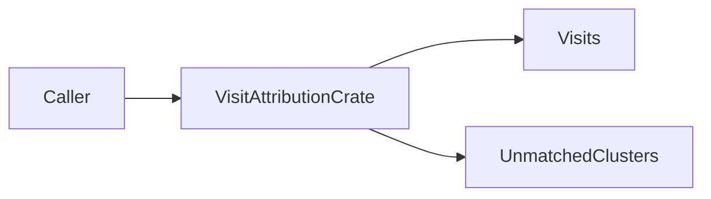
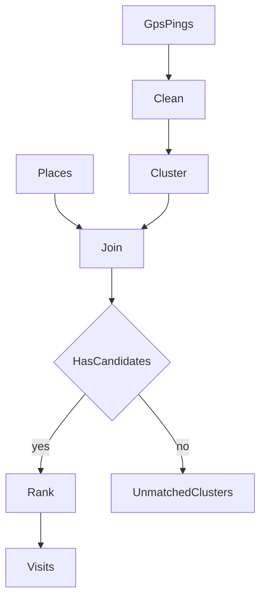
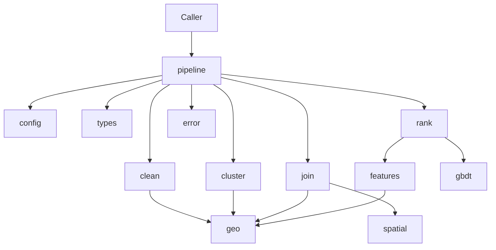
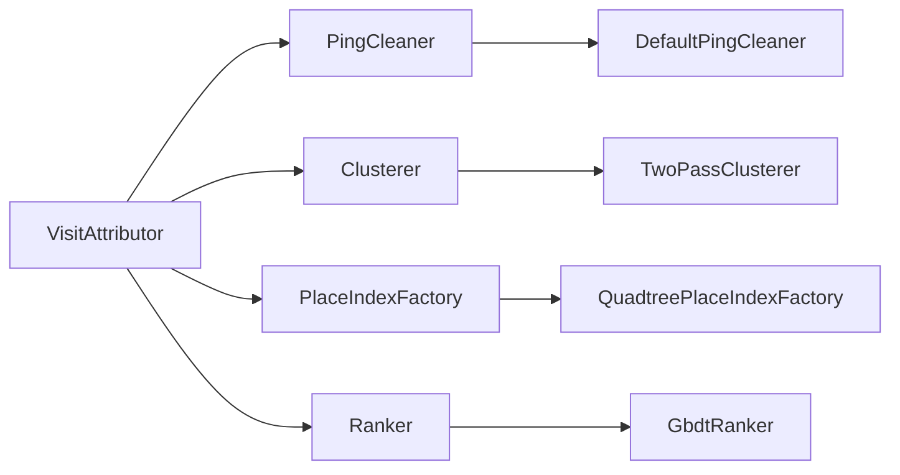

# visit-attribution architecture

This document gives the high-level system architecture of the visit-attribution
crate.

## Purpose and scope

visit-attribution attributes GPS trajectory **pings** to point-of-interest
(**POI**) **visits**.
The pipeline cleans noisy pings, clusters them into potential visits, joins each
cluster to nearby places, and ranks candidates with a preference-learning
gradient-boosted model.

This file covers:

- The crate shape and module map
- The attribution data flow
- Pipeline stages (clean, cluster, join, rank)
- Public API and extension points
- Error contracts at a high level

This file does **not** cover:

- Full usage examples — see [README.md](../../README.md)
- Pipeline edit rules and test recipes — see
  [visit-attribution-pipeline](../skills/visit-attribution-pipeline/SKILL.md)
- Agent index — see [AGENTS.md](../../AGENTS.md)

## System context

The caller supplies a trajectory of GPS pings, a place catalog, and a trained
ranker (wired into `VisitAttributor`).
The crate returns an [`AttributionResult`](../../src/pipeline.rs): attributed
**visits** and **unmatched** stay clusters that had no join candidates.

The crate uses `std` only.
There are no required third-party dependencies.
The minimum supported Rust version (MSRV) is 1.74.



## High-level pipeline

[`VisitAttributor`](../../src/pipeline.rs) runs these steps:

1. **Clean** the ping stream. See [`src/clean.rs`](../../src/clean.rs).
2. **Cluster** cleaned pings into stays (large-POI pass, then density). See
   [`src/cluster.rs`](../../src/cluster.rs).
3. Build a **place index** and **join** each cluster to nearby places. See
   [`src/join.rs`](../../src/join.rs).
4. **Rank** candidates for each cluster with a join set. Empty candidate sets
   become `unmatched_clusters` (not an error). See
   [`src/rank.rs`](../../src/rank.rs).



For default hyperparameters, see [README.md](../../README.md).

## Module map

| Module | Role |
| ------ | ---- |
| `pipeline` | Orchestration, builder, `with_parts`, `AttributionResult` |
| `config` | Pipeline hyperparameters and builder |
| `types` | `Point`, `GpsPing`, `Place`, `Cluster`, `Visit`, `PlaceId` |
| `clean` | Accuracy, jump, and driving filters |
| `cluster` | Large-POI pass and time-aware density clustering |
| `join` | Place index traits and quadtree factory |
| `rank` | `Ranker` / `GbdtRanker` and tournament scorecards |
| `features` | Feature schema, absolute rows, preference pairs |
| `gbdt` | In-crate GBDT train/predict and `VA_GBDT 1` format |
| `geo` | Haversine, PIP, polygon distance/area (**crate-internal**) |
| `spatial` | BBox quadtree (**crate-internal**) |
| `error` | `Error` and `Result` |



## Clean

[`DefaultPingCleaner`](../../src/clean.rs) implements [`PingCleaner`](../../src/clean.rs):

1. Drop non-finite coordinates or accuracy above `max_horizontal_accuracy_m`.
2. Sort by time.
3. Drop impossible jumps (`max_speed_m_s` between consecutive kept pings).
4. Drop fast arrivals inside linear “driving” windows (`linearity_threshold`,
   `driving_speed_m_s`).

The driving filter aims to preserve dwell edges rather than delete entire
windows wholesale.

## Cluster

[`TwoPassClusterer`](../../src/cluster.rs) implements [`Clusterer`](../../src/cluster.rs):

1. **Large-POI pass** — consecutive pings inside large-area place rings
   (`large_poi_area_m2`, area from polygon geometry). Overlaps prefer smaller
   area, then lowest `PlaceId`. Matching pings are consumed.
2. **Density pass** — time-aware sequential density on remaining contiguous
   runs (`dist_threshold_m`, `max_dist_threshold_m`, `max_time_gap_s`,
   `min_cluster_pings`).

This density pass is **not** DBSCAN.
Large-POI consumption splits the trajectory so density cannot merge across a
mall-style stay.

Each [`Cluster`](../../src/types.rs) holds pings, centroid, and time span.
`hour_of_day()` is timezone-naive (`time_s` mod 86400).

## Join

[`QuadtreePlaceIndexFactory`](../../src/join.rs) builds a
[`PlaceIndex`](../../src/join.rs) over place polygons:

1. Index padded place bboxes in a quadtree ([`src/spatial.rs`](../../src/spatial.rs)).
2. Query candidates, then confirm with polygon distance
   ([`src/geo.rs`](../../src/geo.rs)).

A place is a candidate when the cluster centroid **or any ping** is within
`join_radius_m + max(ping horizontal accuracy)` of the polygon (distance `0`
inside).

Caveats:

- Longitude bounding boxes do **not** wrap the antimeridian.
- Empty rings are indexed by a centroid point bbox, but distance to an empty
  ring is infinite, so they never match.
- Cost still scales with places in the local query neighborhood.
  Specialized catalogs should supply a custom `PlaceIndex` via `with_parts`.

## Rank, features, and GBDT

Training and inference live in [`src/rank.rs`](../../src/rank.rs),
[`src/features.rs`](../../src/features.rs), and [`src/gbdt/`](../../src/gbdt/).

**Train** ([`GbdtRanker::train`](../../src/rank.rs)):

1. Build a [`FeatureSchema`](../../src/features.rs) from training places
   (`max_naics4` caps known NAICS4 codes).
2. Emit absolute feature rows per (cluster, candidate).
3. Build unordered preference pairs involving the true place (true id must be
   among **≥2** candidates). Labels are ±1 on feature diffs.
4. Fit the in-crate logistic residual GBDT ([`GbdtModel`](../../src/gbdt/mod.rs)).

Absolute row layout: centroid haversine, polygon distance, dense ranks of each
(1 = closest, min-rank ties), then NAICS4×hour one-hots plus an UNK×hour block.

`dim = 4 + (len(naics4) + 1) * 24`.

The schema is frozen at train time.
Unknown or missing NAICS at serve time maps to the UNK bucket.

**Infer** ([`Ranker::rank`](../../src/rank.rs)):

- Score all unordered pairs; score ≥ 0 awards a win to the left candidate.
- Pick max wins; ties break to the lowest `PlaceId`.
- A singleton candidate list returns that place with `wins = 0`.

Persist with `GbdtRanker::save` / `load` (text `VA_GBDT 1`, `.va` by
convention).
Load validates header, feature dim, and tree limits.

## Public surface and extension points

Stable public surface (see [`src/lib.rs`](../../src/lib.rs)):

- Domain: `Point`, `GpsPing`, `Place`, `PlaceId`, `Cluster`, `Visit`
- Config / errors: `Config`, `ConfigBuilder`, `Error`, `Result`
- Orchestration: `VisitAttributor`, `VisitAttributorBuilder`, `with_parts`,
  `AttributionResult`
- Ranking / ML: `GbdtRanker`, `Ranker`, `GbdtModel`, `TrainConfig`,
  `FeatureSchema`, `LabeledExample`
- Stage traits and defaults used for custom wiring

[`VisitAttributor::builder`](../../src/pipeline.rs) requires a **ranker**.
Defaults wire `DefaultPingCleaner`, `TwoPassClusterer`, and
`QuadtreePlaceIndexFactory`.

Use [`with_parts`](../../src/pipeline.rs) to inject any types that implement the
stage traits (tests and specialized catalogs).

| Trait | Default | Role |
| ----- | ------- | ---- |
| `PingCleaner` | `DefaultPingCleaner` | Filter trajectory noise |
| `Clusterer` | `TwoPassClusterer` | Build stay clusters |
| `PlaceIndexFactory` / `PlaceIndex` | `QuadtreePlaceIndexFactory` | Candidate places per cluster |
| `Ranker` | `GbdtRanker` | Choose among candidates |



`geo` and `spatial` stay crate-internal.
Do not re-export them casually or duplicate haversine / PIP math.

## Errors and contracts

| Variant | When it occurs |
| ------- | -------------- |
| `InvalidInput` | Bad config, empty training pairs, or other validation failures |
| `Model` | Model file or feature schema mismatch |
| `Io` | Save/load and other I/O failures |

Empty join candidate sets are **not** errors.
They appear in `AttributionResult::unmatched_clusters`.

Validate inputs before train/attribute.
Return `Error::InvalidInput` on bad caller data when the stage can detect it.

## Verification and agent layout

Local verify commands (CI parity):

```bash
cargo fmt --all -- --check
cargo clippy --all-targets -- -D warnings
cargo test
```

Unit tests live next to modules under `src/`.
Integration coverage lives under `tests/`.
Runnable scenarios live under `examples/` (`basic`, `multi_stop`,
`strip_mall`, `persist_model`).

Agent support lives under `.agents/`:

- `rules/` — crate policy and domain rules
- `skills/` — pipeline, style, and SOLID skills
- `commands/` — local verify and example commands
- `hooks/` — rustfmt after file edit
- `docs/` — this architecture file

See [AGENTS.md](../../AGENTS.md) for the full index.
